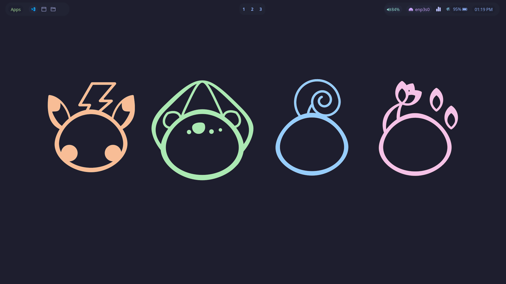
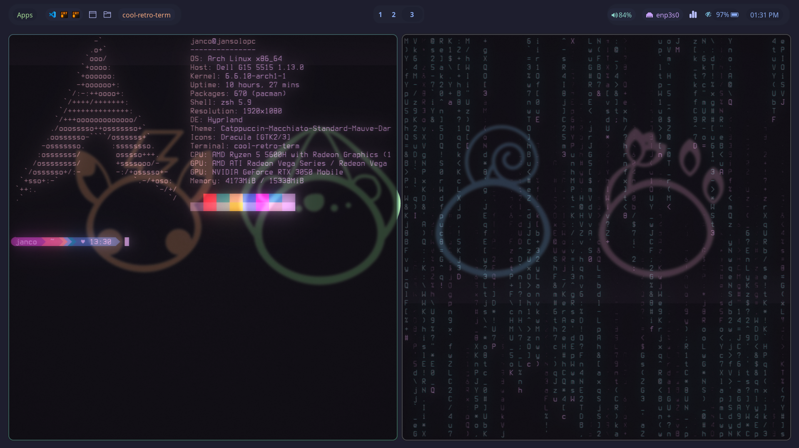

# dotfiles

Minimalistic look using [Hyprland](https://hyprland.org/) for the tiling window manager, Waybar for the top bar, kitty & and zsh for the terminal and shell.

## Theme 

- Catppuccin Macchiato (System theme)
- Dracula (Icon theme)

| Dotfiles |
|-----------| 
| [Hyprland](https://github.com/JanSolo1/dotfiles/tree/main/hyprland/.config/hypr) |
| [Kitty](https://github.com/JanSolo1/dotfiles/tree/main/kitty/.config/kitty) |
| [Waybar](https://github.com/JanSolo1/dotfiles/tree/main/waybar) |
| [ZSH](https://github.com/JanSolo1/dotfiles/tree/main/zshrc) |

## Screenshots 

